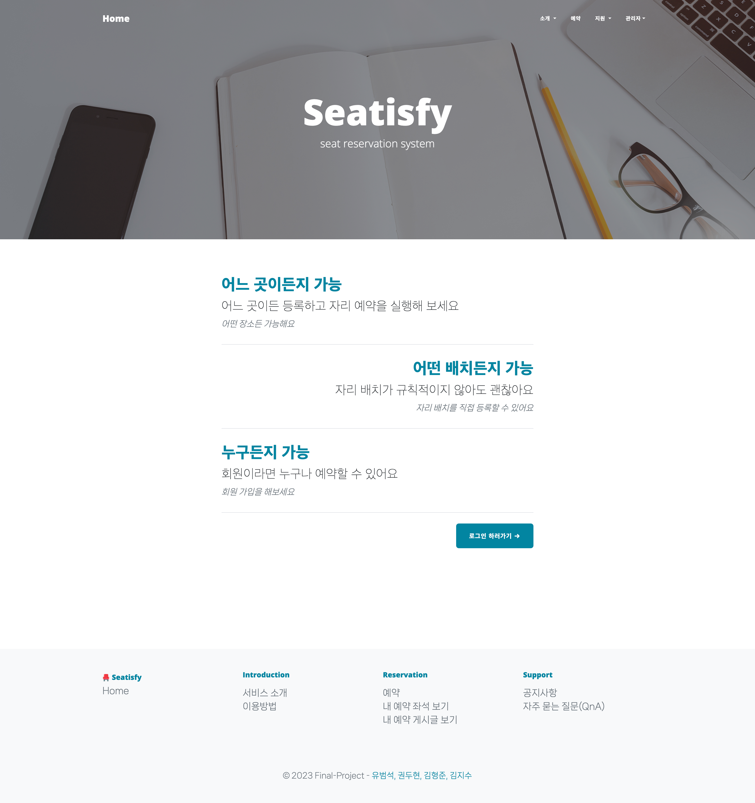
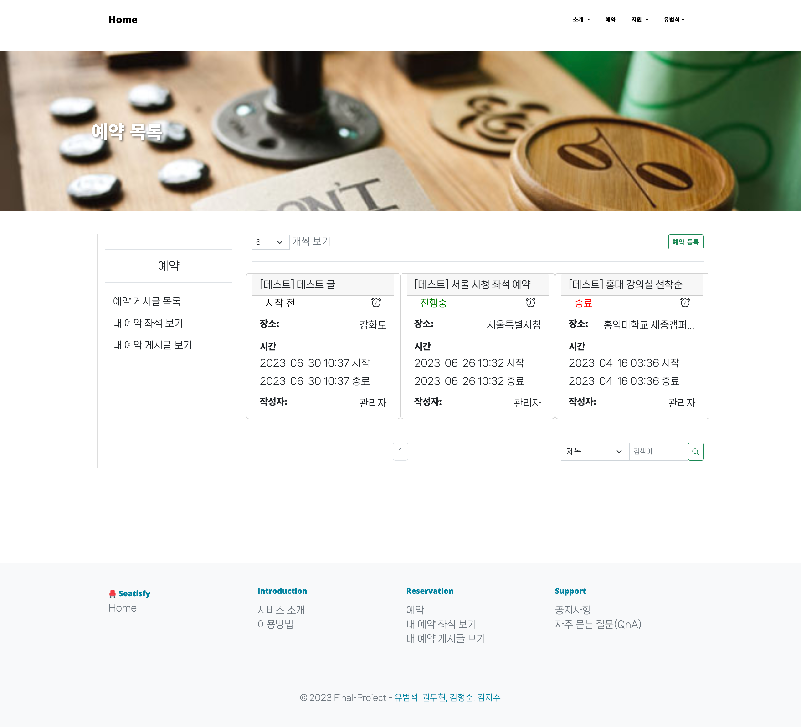
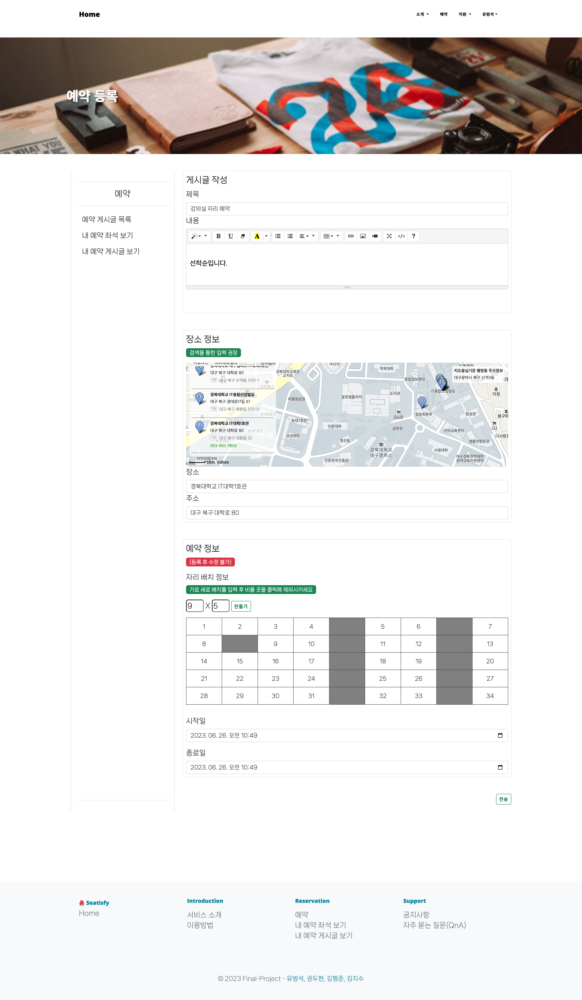
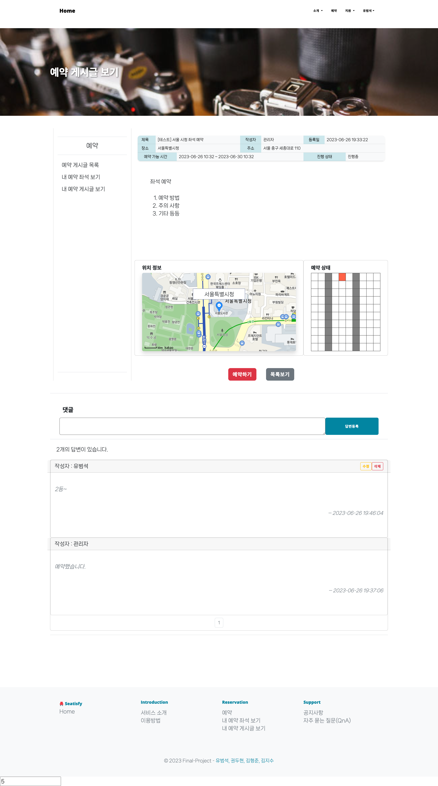
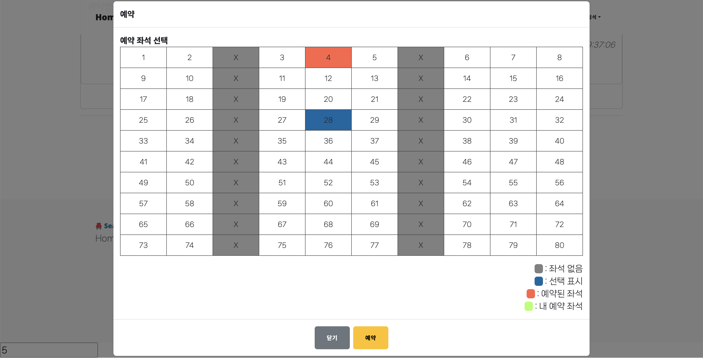
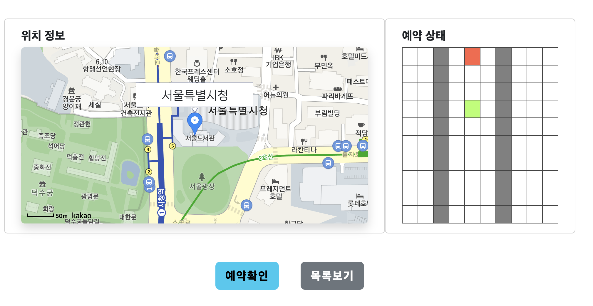
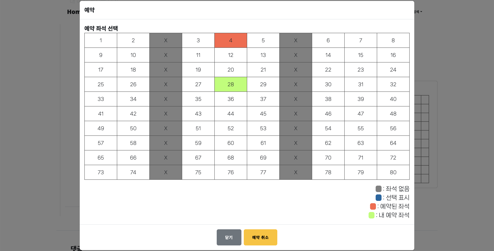
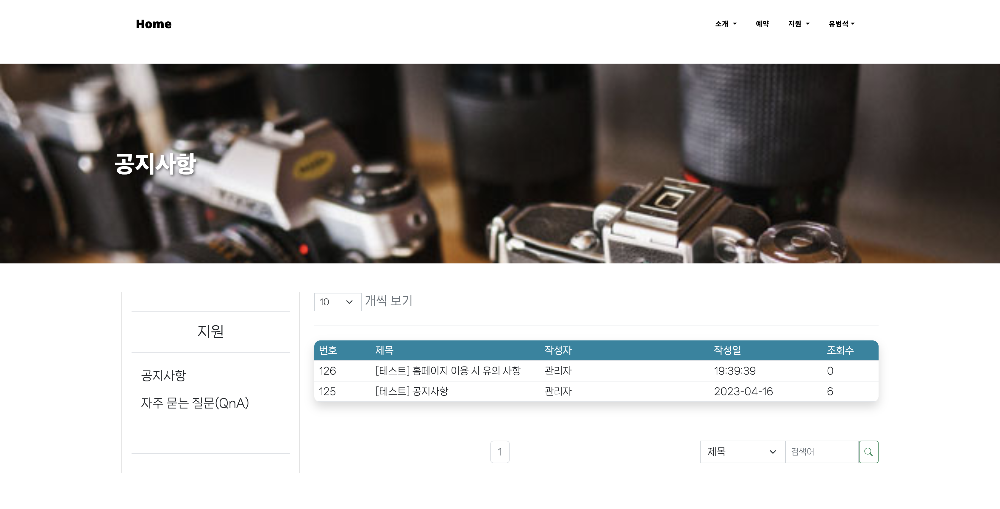
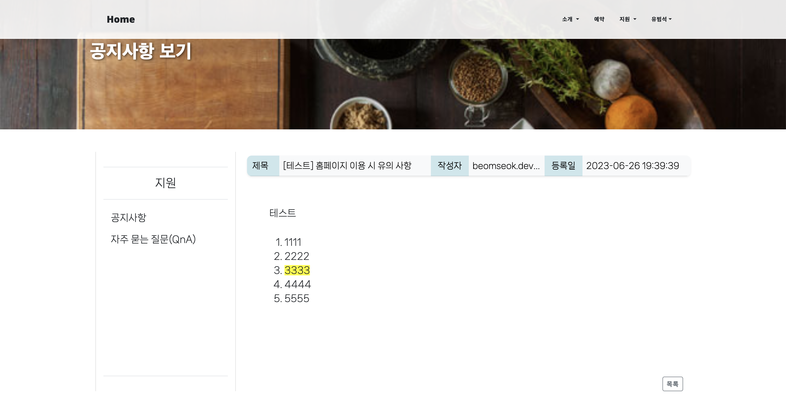

# Seatisfy
좌석 예약 서비스 프로젝트

   

## 팀원

<table>
  <tbody>
    <tr>
      <td align="center"><a href="https://github.com/BeomSeokYu"> <b>BeomSeokYu</b></a> </td>
      <td align="center"><a href="https://github.com/kimjisudev"> <b>kimjisudev</b></a> </td>
      <td align="center"><a href="https://github.com/GwonDooHyeon"> <b>GwonDooHyeon</b></a> </td>
      <td align="center"><a href="https://github.com/gudwns4825"> <b>gudwns4825</b></a> </td>
    </tr>
  </tbody>
</table>

   

## 프로젝트 개요

이 프로젝트는 임의의 장소에 있는 좌석에 대해 누구나 좌석 예약 서비스를 만들고 참여할 수 있도록 하기 위해 개발되었습니다.

#### 프로젝트 목적과 목표
- 기존 좌석 예약 시스템의 문제점
  - 각각의 서비스에서 제공하는 정해진 좌석을 공식적인 일정이 있는 경우 자체적으로 예약 서비스를 실시함
  - 비공식적으로 좌석을 사용하거나 예약 서비스를 제공하지 않는 경우 좌석 예약 서비스를 이용할 수 없음
  - 좌석 배치가 달라지면 서비스 수정 등의 어려움이 생길 수 있음
- 우리 서비스 목표
  - 위의 제시된 문제점을 해결하고자 어떠한 공간에 대한 좌석의 배치를 이용자가 설정하고 등록하여 다른 이용자들이 예약 시스템을 사용할 수 있는 시스템으로 제작
  - 좌석의 예약만을 서비스하여 예약 서비스가 필요한 기업이나 개인이 손쉽게 좌석 예약을 만들고 사용할 수 있는 B2B(Business-to-Business) 비즈니스 모델을 만드는 것이 목표

   

## 기술 스택

#### 🖥️ FE

#### ⌨️ BE

 

###
   

## 주요 기능

#### 인증 및 인가

- `Spring Security`를 이용한 인증 및 사용자 역할에 따른 인가 방식을 기본 세션 & 쿠키 방식을 이용해 구현
- 사용자의 역할은 관리자와 회원으로 구분

#### 예약

- `CSS/JS` 를 이용한 좌석 배치 폼 입력
- `kakao 지도 API`를 이용한 장소 입력
- `DB Lock`을 이용한 좌석 예약시 동시 접근 문제 방지

#### 게시판과 댓글

- 모든 게시판 `MyBatis`를 통한 동적 쿼리 작성으로, 옵션 검색과 게시글 수 조정에 대한 페이징 처리
- 예약 게시판 댓글 기능

   

## 상세 내용
- 노션 페이지 참조 - [이동](https://bsnote.notion.site/588db6c83fd142bcaa1c4ef3d269affb?pvs=4)

   

## 프로젝트 결과 소개
- ### 홈페이지 URL
  [Seatisfy (http://bsyu.shop)]([http://actswoori.org/main.jsp](http://bsyu.shop) "Seatisfy")

 

- ### 메인페이지
  

    
  

- ### 예약 게시글 목록
  

    
  

- ### 예약 게시글 등록
  

    
  

- ### 예약 게시글 상세
  

    
  

- ### 예약 기능
  

    
    
    
  

- ### 공지사항 게시판
  

    
    
  

   
